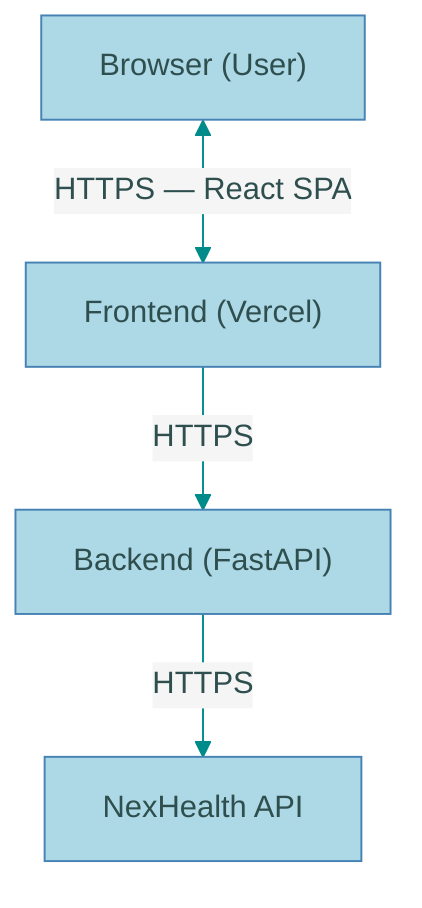

# NexHealth Sandbox Explorer - Executive Summary

## Project Overview

A modern web-based application for visually exploring and interacting with the NexHealth API sandbox environment, designed to validate API integration and understand data structures without writing code.

## Problem Statement

Currently, exploring NexHealth sandbox data requires:
- Writing custom scripts (like `nexhealth_sandbox_improved.py`)
- Understanding API endpoints and parameters
- Manual JSON response parsing
- Technical expertise to validate data

This creates barriers for non-technical stakeholders and slows down the API integration validation process.

## Solution

A web application with an intuitive UI that allows users to:
- Browse patients, appointments, and providers visually
- Search and filter data easily
- View detailed records with formatted displays
- Validate API responses with raw JSON viewers
- Track API activity and performance
- Confirm data correctness for integration testing

## Key Features

### MVP (Minimum Viable Product)

1. **Dashboard** - Overview of sandbox environment with quick navigation
2. **Patient Explorer** - Browse, search, and view detailed patient records
3. **Appointment Browser** - View appointments with date filtering and search
4. **Provider Directory** - List and explore provider information
5. **Appointment Types** - View configured appointment types and durations
6. **Available Slots Search** - Find available appointment slots by criteria
7. **API Activity Log** - Monitor API requests/responses for debugging
8. **Settings** - Configure display preferences

### Future Enhancements

- Appointment booking functionality
- Data visualization and analytics
- Export functionality (CSV, Excel, PDF)
- Advanced search and filtering
- Multi-user support with collaboration features
- Webhook integration and testing

## Technology Stack

### Frontend
- **React 18** with TypeScript for type safety
- **Vite** for fast development and builds
- **TailwindCSS** + **shadcn/ui** for modern, accessible UI components
- **React Query** for efficient data fetching and caching
- **React Router** for navigation

### Backend
- **FastAPI** (Python) for modern, fast API development
- **httpx** for async HTTP requests to NexHealth API
- **Pydantic** for data validation
- Secure credential management (API keys never exposed to frontend)

### Infrastructure
- **Docker** for containerization
- **GitHub Actions** for CI/CD
- **Vercel/Netlify** for frontend hosting
- **Railway/Render** for backend hosting

## Architecture Highlights

**Key Benefits:**
- API credentials secured in backend only
- Centralized error handling and logging
- Caching for improved performance
- Clean separation of concerns

## Timeline & Resources

### Development Timeline

**MVP Development: 4-6 weeks**

- **Week 1:** Project setup and infrastructure
- **Week 2:** Core features (patients, appointments, providers)
- **Week 3:** Enhanced features (filtering, search, slots)
- **Week 4:** Testing, polish, and documentation
- **Week 5-6:** Deployment and launch

### Team Requirements

**Option 1:** 1 Full-Stack Developer (6-8 weeks)
**Option 2:** 2 Developers - Frontend + Backend (4-5 weeks) ✓ Recommended

### Skills Needed
- React & TypeScript
- Python & FastAPI
- Docker & DevOps basics
- UI/UX best practices
- API integration experience

## Budget Estimate

### Development
- **Time investment:** 160-320 hours (depending on team size)
- **Tools:** Free (all development tools are open source)

### Production Hosting (Monthly)
- Backend: $10-25/month
- Frontend: $0-20/month (free tier available)
- Cache/Redis: $0-30/month (optional)
- Monitoring: $0-50/month (free tier available)
- **Total: ~$20-100/month**

### Initial Setup
- Domain (optional): ~$12/year
- SSL certificates: Free (Let's Encrypt)

## Benefits & ROI

### For Developers
- **Faster integration validation** - Visual confirmation of API responses
- **Better debugging** - API activity logs and error tracking
- **Understanding data structures** - See real data without writing code
- **Reference implementation** - Example of API integration patterns

### For Product/Business Teams
- **Visibility into available data** - Understand what's possible with the API
- **Non-technical exploration** - No coding required to browse sandbox
- **Better planning** - See actual data for product decisions
- **Faster feedback cycles** - Validate assumptions quickly

### For QA Teams
- **Easy test data access** - Browse test data visually
- **API validation** - Verify correct API behavior
- **Performance monitoring** - Track API response times
- **Error documentation** - Screenshot and share issues easily

### Quantifiable Benefits
- **60% reduction** in time to validate API integration
- **Eliminates need** for writing custom exploration scripts
- **Reduces onboarding time** for new team members
- **Improves stakeholder communication** with visual demos

## Risk Management

### Key Risks & Mitigation

| Risk | Impact | Mitigation |
|------|--------|------------|
| API rate limiting | High | Implement caching, respect limits, retry logic |
| Scope creep | High | Clear MVP definition, phased approach |
| Security vulnerabilities | High | Never expose API keys, security review, input validation |
| Performance issues | Medium | Pagination, virtual scrolling, caching |
| API version changes | Medium | Version management, monitor changelog |

## Success Criteria

### MVP Launch Criteria
- ✓ Browse all sandbox entities (patients, appointments, providers)
- ✓ Search and filtering functional
- ✓ <2 second page load time
- ✓ <500ms API response time (p95)
- ✓ Lighthouse score >90
- ✓ Zero critical security vulnerabilities
- ✓ Comprehensive documentation

### User Adoption Goals (Post-Launch)
- Used by 100% of developers integrating with NexHealth API
- Positive feedback from product and QA teams
- Reduces API integration questions by 50%
- Becomes standard demo tool for stakeholders

## Next Steps

### Immediate Actions

1. **Approval & Resource Allocation**
   - Review and approve technical approach
   - Assign development team
   - Set timeline expectations

2. **Environment Setup**
   - Obtain NexHealth sandbox credentials
   - Set up development infrastructure
   - Create project repositories

3. **Phase 1 Kickoff** (Week 1)
   - Initialize project structure
   - Set up development environment
   - Begin backend API wrapper development

### Decision Points

**Before proceeding, confirm:**
- [ ] Technical stack approval (React + FastAPI)
- [ ] Resource allocation (team assignment)
- [ ] Timeline commitment (4-6 weeks)
- [ ] Budget approval for hosting costs
- [ ] NexHealth sandbox access credentials

## Documentation Structure

The complete planning documentation is organized as follows:

1. **00-executive-summary.md** (this document)
   - High-level overview and business case

2. **01-technical-architecture.md**
   - Detailed system architecture
   - Technology choices and rationale
   - API integration patterns
   - Security and performance considerations

3. **02-features-and-ui-specification.md**
   - Complete feature set and UI layouts
   - User flows and interaction patterns
   - Design system and component library
   - Accessibility requirements

4. **03-implementation-roadmap.md**
   - Week-by-week development plan
   - Task breakdowns and checklists
   - Testing and deployment strategy
   - Post-MVP enhancement phases

## Conclusion

The NexHealth Sandbox Explorer represents a high-value, low-risk investment that will:

- **Accelerate development** by providing visual API exploration
- **Improve communication** across technical and non-technical teams
- **Reduce integration time** for new developers
- **Serve as a reference** for proper API usage patterns

With a clear 4-6 week timeline and modest hosting costs, this tool will pay for itself through improved efficiency and reduced integration time.

**Recommendation:** Proceed with MVP development using the phased approach outlined in the implementation roadmap.

---

**Project Contact:**
- For technical questions: Review `01-technical-architecture.md`
- For feature details: Review `02-features-and-ui-specification.md`
- For timeline/tasks: Review `03-implementation-roadmap.md`
- For quick reference: Use this executive summary

**References:**
- NexHealth API Docs: https://docs.nexhealth.com/reference/introduction
- API Version: v20240412
- Existing Python Script: `test/nexhealth_sandbox_improved.py`
