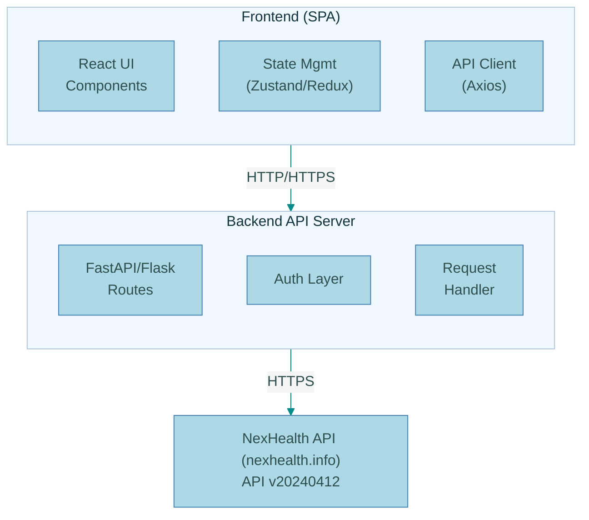

# NexHealth Sandbox Explorer - Technical Architecture

## Overview

A modern web-based application for exploring and interacting with the NexHealth API sandbox environment. This application provides a visual interface to browse patient data, appointments, providers, and other resources available through the NexHealth Synchronizer API (v20240412).

## Architecture Pattern

**Single Page Application (SPA) with RESTful Backend**



## Technology Stack

### Frontend

**Framework & Library Choices:**
- **React 18+** - Modern UI library with hooks and concurrent features
- **TypeScript** - Type safety for robust development
- **Vite** - Fast build tool and dev server
- **TailwindCSS** - Utility-first CSS framework for rapid UI development
- **shadcn/ui** - High-quality accessible React components built on Radix UI

**State Management:**
- **Zustand** or **React Query (TanStack Query)** 
  - Zustand: Simple, lightweight state management
  - React Query: Excellent for server state management, caching, and background updates

**Data Fetching:**
- **Axios** - HTTP client with interceptors for auth and error handling
- **React Query** - For caching, background refetching, and optimistic updates

**Routing:**
- **React Router v6** - Client-side routing with nested routes

**UI Component Libraries:**
- **shadcn/ui** - Accessible, customizable components
- **Lucide React** - Icon library
- **date-fns** - Date formatting and manipulation

### Backend

**Framework Options:**

**Option 1: FastAPI (Recommended)**
```python
Pros:
- Modern, fast Python framework
- Built-in OpenAPI documentation
- Excellent async support
- Type hints and validation with Pydantic
- Familiar for Python developers
```

**Option 2: Express.js (Node.js)**
```javascript
Pros:
- JavaScript/TypeScript across full stack
- Large ecosystem
- Good for real-time features (Socket.io)
```

**Core Dependencies:**
- `fastapi` - Web framework
- `uvicorn` - ASGI server
- `httpx` - Async HTTP client for API calls
- `pydantic` - Data validation
- `python-dotenv` - Environment variable management
- `python-jose` - JWT token handling

### Infrastructure & DevOps

**Development:**
- Docker & Docker Compose - Containerization for consistent environments
- Environment variables (.env files) - Secure credential management
- Hot reload - Both frontend (Vite) and backend (uvicorn --reload)

**Testing:**
- **Frontend:** Vitest, React Testing Library
- **Backend:** pytest, httpx for API testing
- **E2E:** Playwright or Cypress

**Code Quality:**
- ESLint + Prettier (Frontend)
- Black + Ruff (Backend)
- Pre-commit hooks (Husky)

## API Integration Architecture

### Authentication Flow

```
1. Frontend loads → Retrieves API credentials from backend
2. Backend calls POST /authenticates → Receives JWT token
3. Backend stores token in memory/cache
4. All subsequent requests include token in Authorization header
5. Token refresh logic before expiration (decode JWT exp claim)
```

### Backend API Wrapper

The backend acts as a secure proxy to the NexHealth API:

**Benefits:**
- Protects API credentials (never exposed to frontend)
- Centralizes error handling and retry logic
- Adds request/response logging
- Implements rate limiting
- Can add caching layer (Redis)
- Transforms/enriches API responses

**Core Endpoints:**

```
GET  /api/auth/status         - Check authentication status
POST /api/auth/refresh        - Refresh token if needed

GET  /api/institutions        - Get institution info
GET  /api/patients            - List patients with pagination
GET  /api/patients/:id        - Get patient details
GET  /api/appointments        - List appointments with filters
GET  /api/providers           - List providers
GET  /api/appointment-types   - List appointment types
GET  /api/available-slots     - Get available time slots
```

### Error Handling Strategy

**Backend:**
```python
- 401: Re-authenticate automatically
- 404: Return structured error response
- 429: Implement exponential backoff
- 500: Log error, return user-friendly message
- Network errors: Retry with backoff
```

**Frontend:**
```typescript
- Display user-friendly error messages
- Toast notifications for errors
- Retry mechanisms for failed requests
- Graceful degradation
```

## Data Models

### Core TypeScript Interfaces

```typescript
interface Institution {
  id: string;
  name: string;
  subdomain: string;
  locations: Location[];
}

interface Location {
  id: string;
  name: string;
  address?: Address;
  timezone?: string;
}

interface Patient {
  id: string;
  first_name: string;
  last_name: string;
  email?: string;
  phone?: string;
  bio?: {
    date_of_birth?: string;
    gender?: string;
  };
  inactive: boolean;
  created_at?: string;
  updated_at?: string;
}

interface Appointment {
  id: string;
  patient_id: string;
  provider_id?: string;
  start_time: string;
  end_time: string;
  appointment_type_id?: string;
  status?: string;
  did_not_come?: boolean;
  notes?: string;
}

interface Provider {
  id: string;
  first_name: string;
  last_name: string;
  npi?: string;
  email?: string;
}

interface AppointmentType {
  id: string;
  name: string;
  duration: number; // in minutes
  description?: string;
}

interface AvailableSlot {
  lid: string; // location id
  pid: string; // provider id
  slots: TimeSlot[];
}

interface TimeSlot {
  time: string; // ISO 8601 datetime
  provider_id?: string;
  operatory_id?: string;
}
```

## Security Considerations

### Credential Management

1. **Never expose API keys to frontend**
   - All credentials stored server-side
   - Environment variables for configuration
   - .env files in .gitignore

2. **Token Storage**
   - Backend: In-memory or Redis cache
   - Short-lived tokens (decode JWT to check expiration)
   - Automatic refresh before expiration

3. **CORS Configuration**
   - Restrict origins in production
   - Proper credentials handling

### API Request Security

```python
# Backend rate limiting
from slowapi import Limiter
limiter = Limiter(key_func=get_remote_address)

@app.get("/api/patients")
@limiter.limit("30/minute")
async def get_patients():
    ...
```

## Performance Optimization

### Frontend

- **Code splitting** - Route-based lazy loading
- **Memoization** - React.memo, useMemo, useCallback
- **Virtual scrolling** - For large patient/appointment lists
- **Image optimization** - If displaying any images
- **Bundle analysis** - Keep bundle sizes minimal

### Backend

- **Connection pooling** - Reuse HTTP connections to NexHealth API
- **Response caching** - Redis for frequently accessed data
- **Async operations** - Non-blocking I/O for all API calls
- **Pagination** - Always paginate large datasets

### Caching Strategy

```
Institution data: 1 hour cache (rarely changes)
Providers: 30 minutes cache
Appointment types: 30 minutes cache
Patients: 5 minutes cache or cache invalidation on updates
Appointments: No cache (real-time data)
Available slots: 1 minute cache
```

## Development Workflow

### Local Development Setup

```bash
# Clone repository (or use existing)
cd nexhealth-poc

# Backend setup
cd explorer/backend
python -m venv venv
source venv/bin/activate  # or venv\Scripts\activate on Windows
pip install -r requirements.txt
cp .env.example .env
# Edit .env with your NexHealth credentials

# Frontend setup
cd ../frontend
npm install
cp .env.example .env.local

# Run with Docker Compose (recommended)
cd ..
docker-compose up
```

### Environment Variables

**Backend (.env):**
```bash
NEXHEALTH_API_KEY=your_api_key_here
NEXHEALTH_SUBDOMAIN=your_subdomain
NEXHEALTH_LOCATION_ID=your_location_id
NEXHEALTH_BASE_URL=https://nexhealth.info
NEXHEALTH_API_VERSION=v20240412

# Optional
REDIS_URL=redis://localhost:6379
LOG_LEVEL=INFO
CORS_ORIGINS=http://localhost:5173
```

**Frontend (.env.local):**
```bash
VITE_API_URL=http://localhost:8000
```

## Deployment Considerations

### Production Architecture

```
Frontend: Vercel, Netlify, or AWS S3 + CloudFront
Backend: AWS ECS, Google Cloud Run, or Railway
Cache: Redis Cloud or AWS ElastiCache
Monitoring: Sentry, DataDog, or LogRocket
```

### Scalability

- Stateless backend design enables horizontal scaling
- Redis for distributed caching
- Load balancer for multiple backend instances
- CDN for frontend static assets

## API Version Management

**Current Version:** v20240412

**Strategy:**
- Backend abstracts API version from frontend
- Environment variable for API version
- Version-specific adapters if needed
- Monitor NexHealth changelog for updates

## Monitoring & Logging

### Application Logging

```python
# Structured logging
import structlog

logger = structlog.get_logger()

logger.info(
    "api_request",
    endpoint="patients",
    patient_id=patient_id,
    response_time_ms=elapsed
)
```

### Metrics to Track

- API response times
- Error rates by endpoint
- Cache hit/miss rates
- Authentication failures
- Rate limit warnings

## Future Enhancements

1. **Real-time updates** - WebSocket for appointment changes
2. **Advanced filtering** - Complex search across entities
3. **Bulk operations** - Import/export functionality
4. **Analytics dashboard** - Visual charts and insights
5. **Webhook handling** - Real-time event processing
6. **Multi-tenant support** - Multiple sandbox accounts
7. **Audit logging** - Track all data access
8. **API playground** - Interactive API testing tool

## References

- NexHealth API Documentation: https://docs.nexhealth.com/reference/introduction
- NexHealth Quickstart: https://docs.nexhealth.com/docs/developer-portal-quickstart-guide
- API Version: v20240412
- OpenAPI Spec: https://docs.nexhealth.com/v20240412/openapi/nexhealth-api.json
